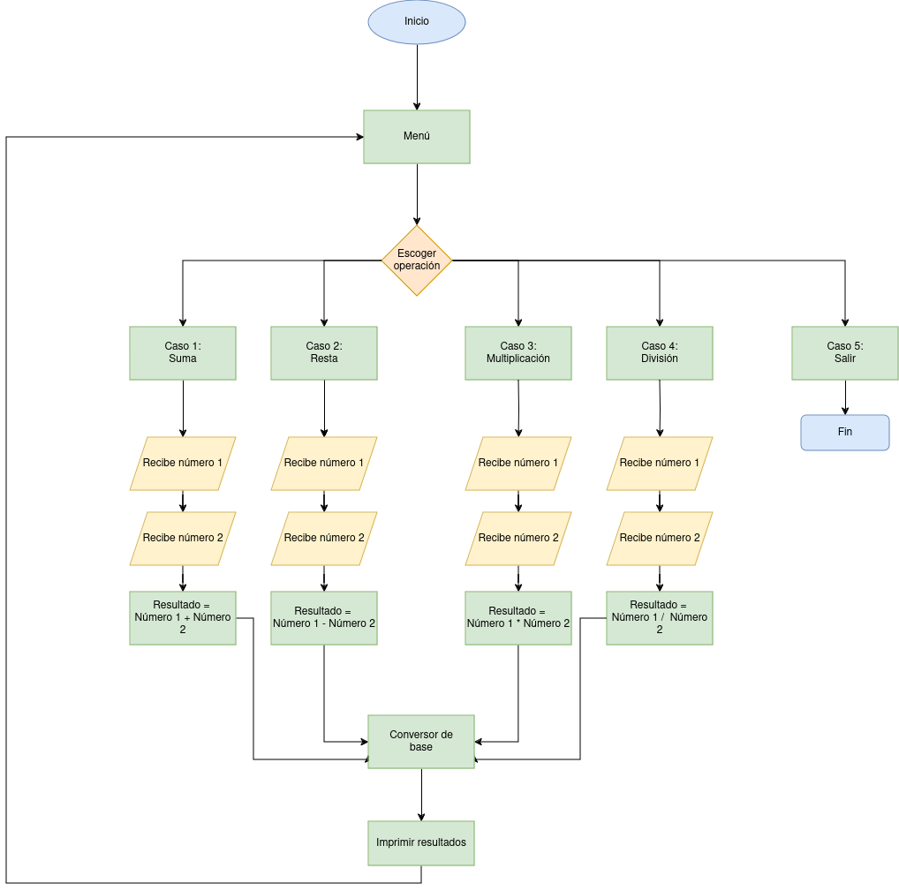
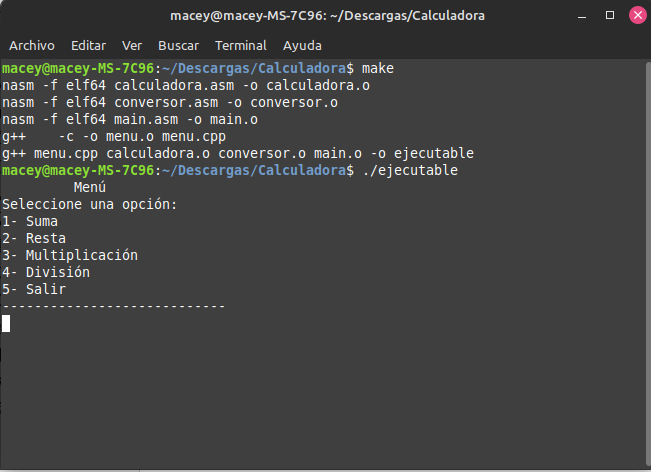

# README
Calculadora en modo texto basado en una arquitectura x86 sobre un sistema operativo Linux 

## Sobre el proyecto
Tarea 1 <br />
En este programa se desarrolló una calculadora en modo texto utilizando el ensamblador `NASM` de la arquitectura x86-64 <br />
La calculadora genera un menú principal en el que se puede elegir las diferentes operaciones que se pueden ejecutar (Sumar - Restar - Multiplicar - Dividir). El programa recibe dos números y hace la operación correspondiente.
<br />
El programa va a desplegar la información resultante en diferentes bases (Decimal - Binario - Octal - Hexadecimal)
<br />
A continuación se encuentra el diagrama de flujo que representa la ejecución del programa
<br />



## Integrantes
- Macey Bourrouett Obando - C11183 <br /> 
- Iván Marín Cordero - C24524


## Instalación
1. Clonar el repositorio
```
git clone https://github.com/virtualbomy/Calculadora.git
```  
2. Abrir la terminal en la carpeta resultante y para ejecutar el programa escribir el comando
```
 make run
```
3. Escribir el comando para abrir el debug
```
make debug
```
4. Para eliminar los archivos generados utilizar el comando 
```
make clean
```

## Uso
1. Al ejecutar el programa aparecerá el menú principal de la calculadora. Desde aquí se podrá ingresar a las diferentes operaciones que se pueden realizar. También se puede salir del programa y terminar la ejecución.
<br/><br/> 



